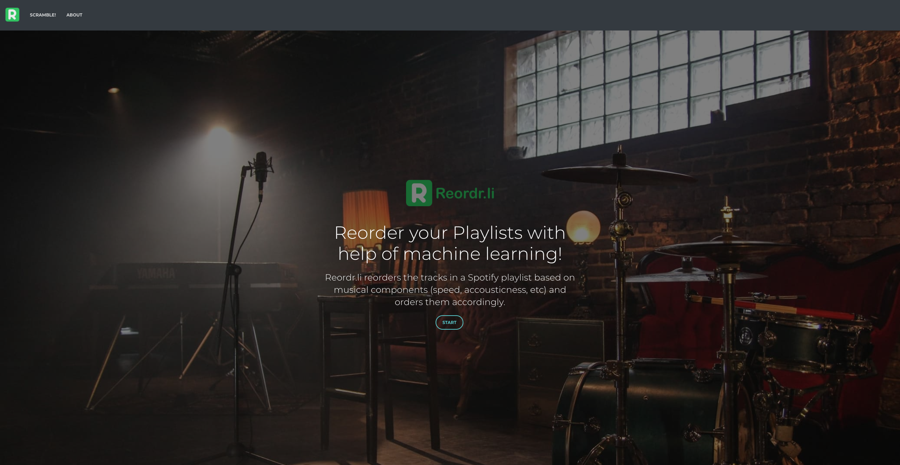
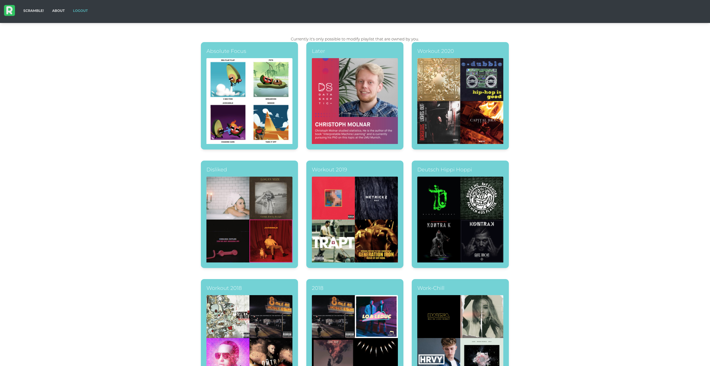
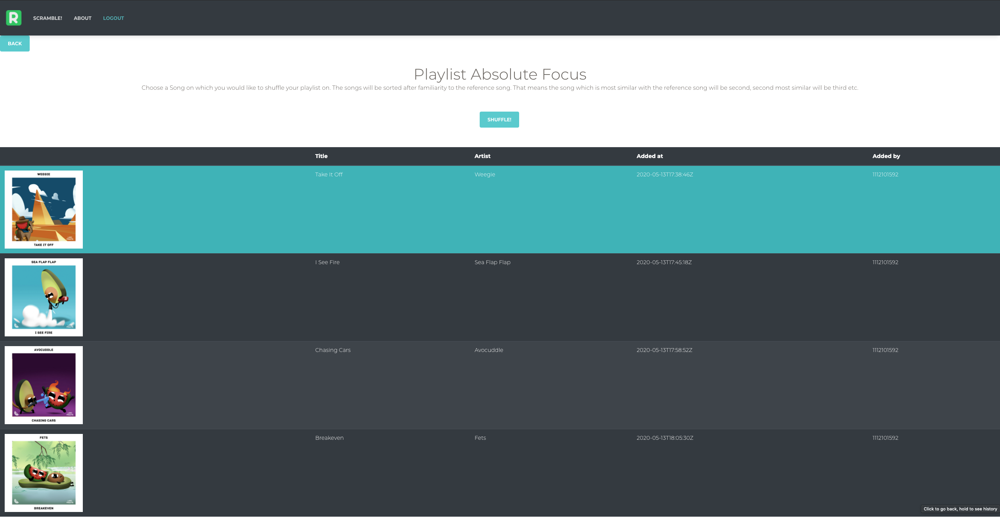

# Reordrli

Reordr.li is a web application that allows you to shuffle your Spotify playlist with the help of machine learning. You choose a playlist and a song you like in that playlist. The application reorders the playlist on how similar the songs are to your preferred song.

The frontend is a angular application which communicates directly with the Spotify Developer API, as well as the implemented backend with Djano REST-Framework. The backend, handles the shuffling as well as the shuffling algorithm.

This repository contains two subrepos:
 
- reordr.li_backend: This is the django rest API
- reordr.li_frontend: The Angular application.

Developer contact: 
<silas.stulz@gmail.com>
